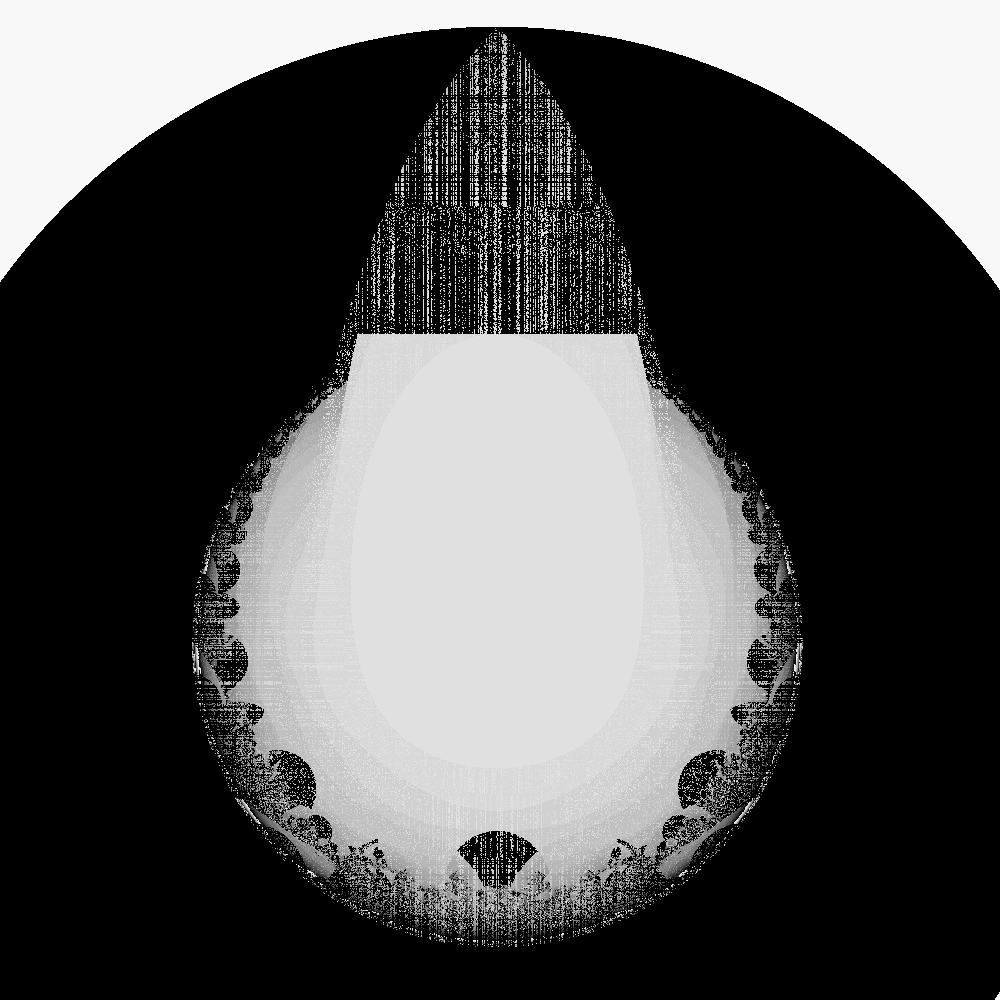
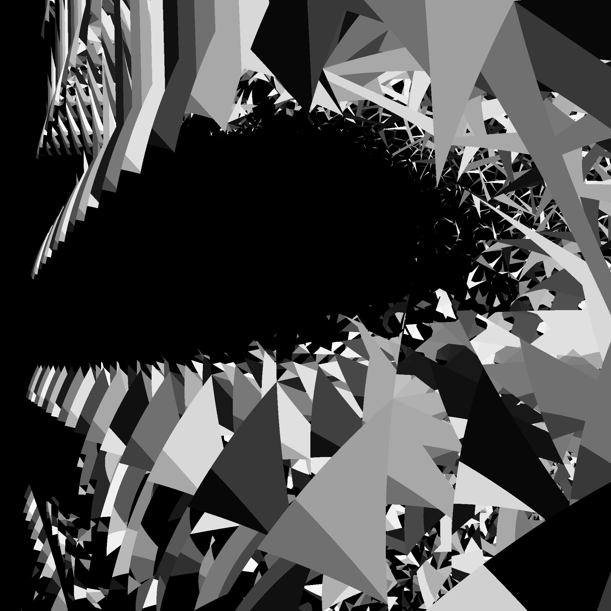

# rustmandel

|  |  |
|----|---|

Mandelbrot zoomer in Rust with Piston for graphics.

Recommend release build: `cargo run --release`

Controls:

* Left/right-click to zoom;
* Left/right/up/down arrows for movement;
* LeftShift/RightShift to decrease/increase the movement increment;
* C to center on the mouse cursor;
* Brackets to decrease/increase max iterations;
* Tab/\ to decrease/increase the iteration increment;
* z// to decrease/increase the zoom factor;
* ,/. to decrease/increase the number of Buddhabrot points;
* M/J to switch to (M)andelbrot/(J)ulia;
* 1/2 to decrease/increase window size;
* 0 to cycle color schemes;
* S to save the image to the save/image/ dir;
* X to clear canvas;
* F to bookmark/save the position and thumbnail to save/cfg/ and save/thumb/ dirs;

Learning Rust, so the code is very nascent probably.
Any comments welcome.

Enjoy the [LICENSE](./LICENSE).

|  |  |
|----|---|
